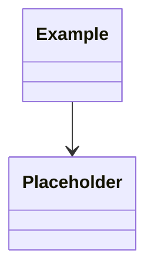

# docs-scaffold

Manual-trigger skill. Creates a standard documentation layout and wires it into agent session memory.

## When to run

Only when the user explicitly asks. Examples: "scaffold docs", "set up the docs structure", "/skill:docs-scaffold".

Do **not** run automatically. If `docs/` already has substantive content, list what exists and confirm with the user before writing anything.

## Concept

Four buckets, each with a distinct purpose:

| Folder | Purpose | Audience | Lifecycle |
|---|---|---|---|
| `docs/context/` | Why the project exists, who it's for | Humans + agents | Stable |
| `docs/desired-state/` | North star: goals, invariants, domain model | Agents read every session | Long-lived, pruned for sharpness |
| `docs/technical/` | Landed knowledge: ADRs, guides | Reference on demand | Append-only (ADRs), evolving (guides) |
| `docs/day-to-day/` | Active cross-session context | Agents read + write | Weekly churn, aggressively pruned |

**Recursive:** in monorepos, sub-scopes at conventional code boundaries (`services/*`, `apps/*`, `packages/*`) may have their own `docs/` mirroring this layout. Parent docs link to relevant children; agents follow links into subnodes whose code they're touching this session.

**Budget:** ~300 lines per scope's `desired-state/`, agents traverse ~3 scopes deep per session max. Above that, prune or split.

**Invariants are invariant:** if a sub-scope contradicts a parent's invariant, that is a split-brain design error to escalate to a human, not silently resolve.

## Steps

1. **Survey state.** Check for existing `docs/`, `AGENTS.md`, `CLAUDE.md`. List anything that already exists. If `docs/` has content, ask before proceeding.

2. **Create the tree.** Only write files that don't already exist; never overwrite user content. Use the templates in the `templates/` section below verbatim.

   ```
   docs/
   ├── README.md
   ├── context/
   │   └── context.md
   ├── desired-state/
   │   ├── goals.md
   │   ├── invariants.md
   │   └── domain-model.md
   ├── technical/
   │   ├── README.md
   │   ├── adrs/
   │   │   └── 0001-record-architecture-decisions.md
   │   └── guides/
   │       └── .gitkeep
   └── day-to-day/
       ├── handoff.md
       ├── focus.md
       ├── notes.md
       └── exploration-log.md
   ```

3. **Inject the AGENTS.md memory block.** The block is delimited by markers so it can be regenerated idempotently:

   - If `AGENTS.md` exists and contains `<!-- docs-skill:start -->` / `<!-- docs-skill:end -->` markers, **replace** the content between them.
   - If `AGENTS.md` exists without markers, **append** the block at the end with a leading blank line.
   - If `AGENTS.md` does not exist, **create it** containing only the block.

   Never modify content outside the markers.

4. **Offer to scaffold a sub-scope.** If this is a monorepo (detect via `services/`, `apps/`, `packages/`, workspace config), ask the user whether they want any sub-scope scaffolded now. Do not auto-scaffold sub-scopes.

5. **Report.** Print:
   - Files created
   - Files skipped (already existed)
   - Where the AGENTS.md block landed (created / appended / replaced)
   - Next step suggestion: "Fill in `docs/desired-state/goals.md` and `invariants.md` first — those are the highest-leverage files."

---

## Templates

Write each file with the exact content below.

### `docs/README.md`

```markdown
# Documentation

Structured docs for humans and agents. Layout:

- **`context/`** — Why this project exists, users, owners. Stable.
- **`desired-state/`** — Goals, invariants, domain model. The north star agents read every session.
- **`technical/`** — ADRs and guides. Landed knowledge.
- **`day-to-day/`** — Active cross-session context. Handoffs, focus, notes, exploration log.

See `AGENTS.md` for how agents use this tree.

## Sub-scopes

In monorepos, services/apps/packages may have their own `docs/` mirroring this layout. Link relevant sub-scopes here:

<!-- e.g. - [services/auth](../services/auth/docs/) -->
```

### `docs/context/context.md`

```markdown
# Project Context

<!-- Why does this project exist? Who is it for? Who owns it?
     Keep concise (~100 lines). Split into separate files only if it grows past that. -->

## Mission

<!-- One paragraph. What outcome does this project create? For whom? -->

## Users

<!-- Who uses this? What do they need from it? Personas if useful. -->

## Owners & stakeholders

<!-- Who's accountable. Who needs to be consulted on major changes. -->

## History (optional)

<!-- Brief — only if context for decisions requires it. -->
```

### `docs/desired-state/goals.md`

```markdown
# Goals

<!-- The higher-order outcomes we're working toward. Merged "ideal state" + "higher-order goals".
     Each goal should be specific enough that you could tell whether you've achieved it.
     Time-scope goals if useful (this quarter / this year / 5-year vision). -->

## Current goals

<!-- e.g.
- Self-serve onboarding: new users complete signup and reach first value without human intervention.
- Sub-100ms p99 for the read path under nominal load.
-->
```

### `docs/desired-state/invariants.md`

```markdown
# Invariants

<!-- Properties that must always hold for the system to be in its desired state.
     Short, declarative, falsifiable. If a change would violate one, that change is wrong
     OR the invariant is wrong — never silently both.

     Examples:
     - All authentication flows use SSO.
     - The admin dashboard must be servable as a static page.
     - User data is stored in the EU region only.
     - No service depends on another service's database directly. -->
```

### `docs/desired-state/domain-model.md`

```markdown
# Domain Model

<!-- High-level entities and how they relate. Conceptual, not an ERD —
     no attributes, no cardinality, no FKs. Just nouns and relationships.
     Use Mermaid. Add a short glossary if terms are non-obvious. -->



## Glossary

<!-- Term — one-line definition. Only for non-obvious domain terms. -->
```

### `docs/technical/README.md`

```markdown
# Technical Docs

- **`adrs/`** — Architecture Decision Records. MADR format. Numbered, append-only, immutable once accepted.
- **`guides/`** — How things work, how to do things. Sequence diagrams live inline as Mermaid.

API documentation is auto-generated and lives at: <!-- link to Swagger UI / generated site / etc. -->
```

### `docs/technical/adrs/0001-record-architecture-decisions.md`

```markdown
# ADR-0001: Record architecture decisions

- Status: Accepted
- Date: <!-- YYYY-MM-DD -->

## Context and Problem Statement

We need a durable record of significant architecture decisions so future contributors (human and agent) understand *why* the system looks the way it does, not just *what* it looks like.

## Decision Drivers

- Future contributors lose context fast without written rationale.
- Agents need machine-readable history to avoid re-litigating settled choices.
- Decisions tied to alternatives we considered prevent re-attempting ruled-out paths.

## Considered Options

- Free-form decision notes in a wiki.
- No formal record (rely on git history and tribal knowledge).
- MADR-formatted ADRs in this repo.

## Decision Outcome

Chosen: **MADR-formatted ADRs in `docs/technical/adrs/`**, numbered sequentially, immutable once `Accepted`. Pairs with `docs/day-to-day/exploration-log.md`: ruled-out options graduate into ADR `Considered Options` when a decision lands.

### Consequences

- Every significant architecture decision gets a numbered ADR.
- Superseding an ADR is done by writing a new ADR that references the old one and updating the old one's status to `Superseded by ADR-NNNN`.
- Trivial decisions (library version bumps, code style) do not get ADRs.
```

### `docs/technical/guides/.gitkeep`

```
```

### `docs/day-to-day/handoff.md`

```markdown
# Handoff

<!-- "Where we left off." Overwritten at the end of each meaningful session by docs-update.
     Backward-looking. Resets each session. -->

## Last session

_No prior session yet._

## Loose threads

<!-- Things half-done, deferred decisions, open questions. -->

## Suggested next steps

<!-- 1-3 bullets the next session can pick up immediately. -->
```

### `docs/day-to-day/focus.md`

```markdown
# Current Focus

<!-- Forward-looking. Replace when focus shifts. Keep to ~20 lines.
     The link between current work and a higher-order goal. -->

**Now:** <!-- one line: what we're working on right now -->

**Toward goal:** <!-- one line: which entry in desired-state/goals.md this serves -->

**Out of scope:** <!-- 1-2 bullets: things explicitly not part of this focus -->
```

### `docs/day-to-day/notes.md`

```markdown
# Operational Notes

<!-- "Weather, not climate." Current-state quirks an agent should know about but that
     don't belong in AGENTS.md (too verbose / temporal) or technical/ (not landed knowledge).

     Each entry: `YYYY-MM-DD — <note>`.
     docs-update prunes stale items (>30 days old gets `<!-- stale? -->` flag for review). -->
```

### `docs/day-to-day/exploration-log.md`

```markdown
# Exploration Log

<!-- "What we've tried and ruled out." Prevents re-attempting dead ends across sessions.
     Granularity: strategy-level pivots only. Not "used ripgrep instead of sed".
     Yes: "tried library X, ruled out for reason Y."

     Sections are per topic, soft-coupled to milestones by name. A section is deletable
     once a corresponding ADR lands in technical/adrs/ — docs-update will prompt to delete.

     Format per section:

     ## <Topic> (milestone: <name or id>)

     - YYYY-MM-DD — Tried <X>. Ruled out: <reason>.
     - YYYY-MM-DD — Considered <Y>. Paused: <blocker>. Reopen if <condition>.
     - YYYY-MM-DD — Landed on <Z> → see ADR-NNNN. **Delete this block once ADR-NNNN is merged.**
-->
```

### `AGENTS.md` block

The text below goes between the markers. Replace `<!-- docs-skill:start -->` and `<!-- docs-skill:end -->` literal markers — they are the contract for idempotent updates.

```markdown
<!-- docs-skill:start -->
## Documentation contract

This repo uses a structured docs layout (see `docs/README.md`). Follow these rules in every session:

1. **At session start**, read the closest `docs/desired-state/` to the work you're about to do:
   - Always read repo-root `docs/desired-state/{goals,invariants,domain-model}.md`.
   - If you're working under a sub-scope with its own `docs/desired-state/` (e.g. `services/X/docs/desired-state/`), read that too.
   - Follow links from parent `docs/README.md` into sub-scopes whose code you'll touch. Skip the rest.

2. **Also read** `docs/day-to-day/handoff.md` and `docs/day-to-day/focus.md` at session start to pick up cross-session context.

3. **Invariants are hard constraints.** If a change would violate one in any `desired-state/invariants.md`, stop and escalate to the user — do not silently resolve. Either the invariant is wrong (update it) or the change is wrong (revisit).

4. **At the end of meaningful work** (feature done, milestone hit, before PR, or when the user signals end-of-session), invoke `/skill:docs-update` to refresh `day-to-day/` files and prompt for ADRs.

5. **Budget:** keep each scope's `desired-state/` under ~300 lines total. Traverse at most ~3 scopes deep per session. If you're hitting the budget, propose pruning.
<!-- docs-skill:end -->
```
